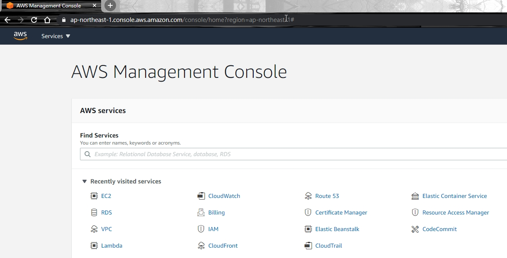
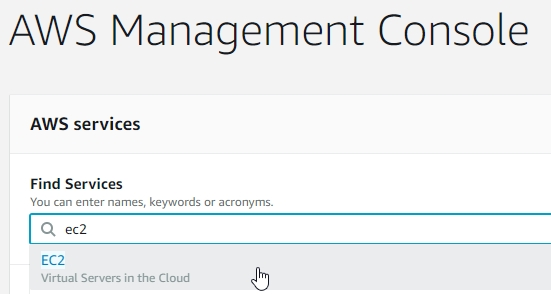
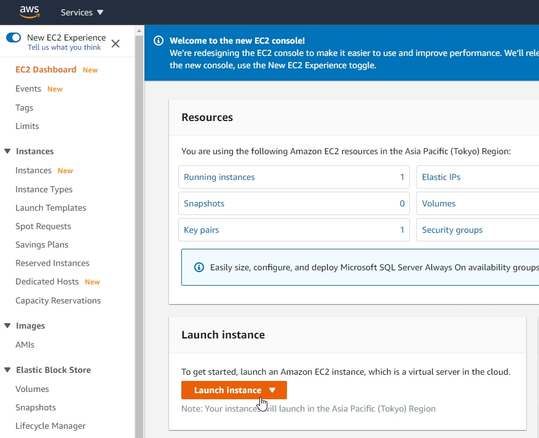
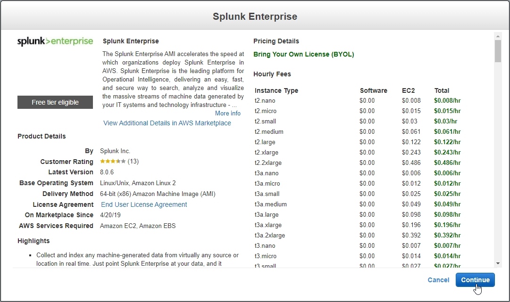

# Launch Splunk Instance On AWS
1. Login AWS Console

2. Enter EC2 Console

3. Click "Launch Instance"

4. Type "splunk" in the search box and Choose "Splunk Enterprise" in "AWS Marketplace"


5. 

```json
{
    "Version": "2012-10-17",
    "Statement": [
        {
            "Effect": "Allow",
            "Principal": "*",
            "Action": "s3:GetObject",
            "Resource": "arn:aws:s3:::xxxxxx/*"
        }
    ]
}
```

20. Click "Save"
15. Access Static website hosting Endpoint Again
16. The Website can display normally now
