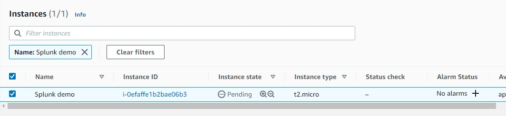

# Launch Splunk Instance On AWS
1. Login AWS Console & Enter EC2 Console  
2. Click "Launch Instance" and Type `splunk` in the search box and Choose "Splunk Enterprise" in "AWS Marketplace"  
  
3. Splunk EC2 Instance Detail Setting  
* Instance type : t2.micro  
* Subnet : Public Subnet  
* Storage : 20GB(GP2)  
* Security Group : 

| TCP/UDP | Port | IP        |
| ------- | ---- | --------- |
| TCP     | 22   | your IP   |
| TCP     | 8000 | 0.0.0.0/0 |
| TCP     | 554  | 0.0.0.0/0 |
| TCP     | 8089 | 0.0.0.0/0 |
| TCP     | 9997 | 0.0.0.0/0 |
| TCP     | 443  | 0.0.0.0/0 |
| TCP     | 8088 | 0.0.0.0/0 |

  
1. wait Splunk Splunk Status is "running"  
  
5. Now You can use the browser to open Splunk  
  
6. Reset Splunk default password  
First, connect to Splunk Instance by "SSH" or "Putty"  
```bash
ssh ec2-user@<splunk-instance-ip> -i keypair.pem
```
  
Then run:  
```bash
sudo su
cd /opt/splunk/etc
mv passwd passwd.old
cd /opt/splunk/etc/system/local
vim user-seed.conf
```
user-seed.conf:  
```
[user_info]
USERNAME = admin
PASSWORD = password
```
Restart Splunk service  
```bash
/opt/splunk/bin/splunk restart
```
7. Now You can login to splunk by New password  

