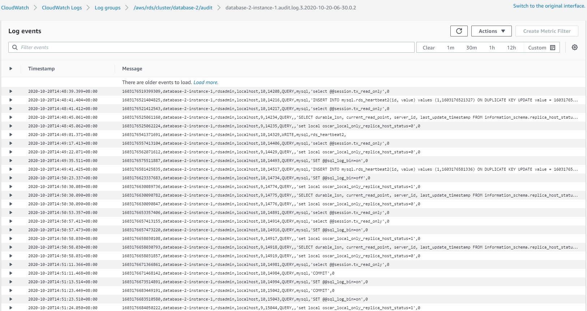

# Launch Aurora MySQL
1. Enter RDS Console  
  
2. Click "Parameter groups" and Click "Create parameter group"  
  
3. Parameter group detail  
* Parameter group family : aurora-mysql5.7  
* Type : DB Cluster Parameter Group  
* Group name : `your group name`  
  
4. Click New Parameter group and change parameters  
* slow_query_log = 1  
  
* general_log = 1  
  
* long_query_time = 0.1 (100ms)  
  
* log_queries_not_using_indexes = 1  
  
* log_output = FILE  
  
* server_audit_logging = 1  
  
* server_audit_events = CONNECT,QUERY,QUERY_DCL,QUERY_DDL,QUERY_DML,TABLE  

| Event     | Description                                                                      |
| --------- | -------------------------------------------------------------------------------- |
| CONNECT   | 記錄成功與失敗連線，還有中斷連線。此事件包含使用者資訊                           |
| QUERY     | 以純文字記錄所有查詢，包括因為語法或許可錯誤而失敗的查詢                         |
| QUERY_DCL | 類似於 QUERY 事件，但只傳回資料控制語言 (DCL) 查詢 (GRANT、REVOKE 等)            |
| QUERY_DDL | 類似於 QUERY 事件，但只傳回資料定義語言 (DDL) 查詢 (CREATE、ALTER 等)            |
| QUERY_DML | 類似於 QUERY 事件，但只傳回資料操作語言 (DML) 查詢 (INSERT、UPDATE 和 SELECT 等) |
| TABLE     | 記錄因為執行查詢而受影響的資料表                                                 |

  
1. Click "Databases" and Click "Create database"  
  
6. Choose Engine type  
* Engine type : Amazon Aurora  
* Edition : Amazon Aurora with MySQL compatibility  
* Capacity : Provisioned  
* Version : Aurora (MySQL 5.7) 2.09.0  
  
* Templates : Dev/Test  
* DB instance class : Burstable classes (includes t classes)  
* DB instance type : db.t2.small  
* Multi-AZ deployment : Don't create an Aurora Replica  
  
* Additional configuration  
* DB cluster parameter group : `your parameter group name`  
  
* Log Exports : Audit log, Error log, General log, Slow query log  
  
Click "Create database"  
7. Wait for the database status to be available  
  
You can see MySQL Logs in the AWS Cloudwatch Logs  
  
  