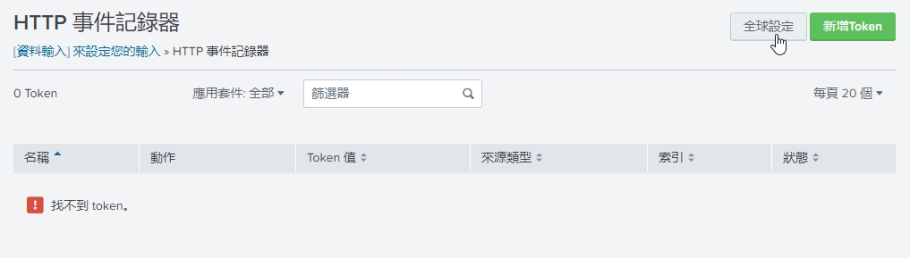

# Set Splunk HTTP event Collector
1. Login Splunk and Click "Settings->Data inputs"

2. Click "HTTP Event Collector"

3. Click "Global Settings"

4. Edit Global Settings
* All Tokens : Enabled
* Enable SSL : false

5. Click "New Token"
6. Type 
* Name : `your collector name`  
  
* App Context : `Search & Reporting (search)`  
  
Click "Review" -> "Summit"  

7. New you have a splunk token for lambda

8. You can try this token
```ssh
curl -k  http://splunk-ip:8088/services/collector -H "Authorization:Splunk splunk-hec-token" -d "{\"sourcetype\":  \"trial\",\"event\":\"hello world!\"}"

-- For example
curl -k  http://13.113.194.6:8088/services/collector -H "Authorization:Splunk 572a98bb-36f9-4240-9774-b9743cd4467a" -d "{\"sourcetype\":  \"trial\",\"event\":\"hello world!\"}"
```


