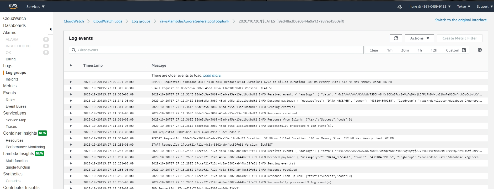

# Launch Splunk Instance On AWS
1. Enter Lambda Console  and Click "Create function"  
  
2. Choose "Use a blueprint"  
  
3. Type `splunk` in the search box and choose "splunk-cloudwatch-logs-processor"  
  
4. Lambda - Basic information  
* Function name : `your lambda name`  
* Execution role : Create a new role with basic Lambda permissions   
  
5. Lambda - Cloudwatch Logs trigger  
* Log group : `your cloudwatch logs name`  
* Filter name : `your filter name`  
  
6. Lambda - Environment variables  
* SPLUNK_HEC_URL : http://`splunk-ip`:8088/services/collector  
* SPLUNK_HEC_TOKEN : `splunk-http-hec-token`  
  
7. Create function  
  
8. Choose "Designer->CloudWatch Logs" and enable Cloudwatch Logs trigger  
  
  
9. Now you can watch Lambda logs and metrics and Splunk  
  
  
  