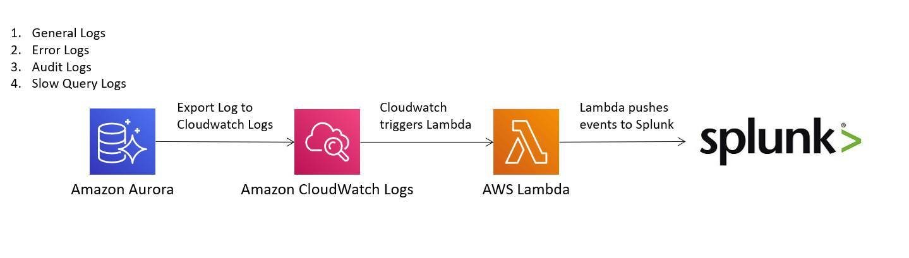

# aws-lambda-splunk-http-event-collector
## Architecture diagram

## Agenda
1. [Launch Splunk Instance On AWS](./01-launch-splunk-instance-on-aws/README.md)
2. [Launch Aurora MySQL](./02-launch-aurora-mysql/README.md)
3. [Set Splunk HTTP Event Collector](./03-set-splunk-http-event-collector/README.md)
4. [Create AWS Lambda Function](./04-create-aws-lambda-function/README.md)
